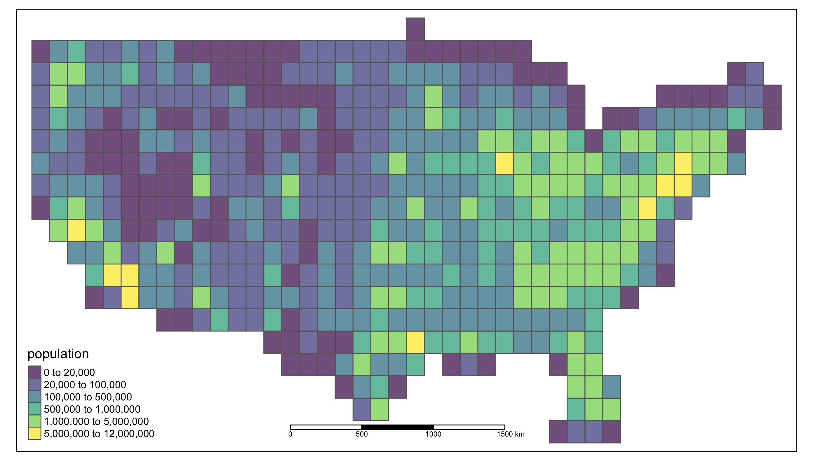

# DeGAUSS Schwartz Guide <a href='https://degauss-org.github.io/DeGAUSS/'></a> 

This step-by-step guide covers how to add daily spatiotemporal PM25, NO2, and O3 estimates from models created by Joel Schwartz and used within CREW. We assume that the user starts with geocoded data, but DeGAUSS can also be used to geocode address data if needed. 

For detailed documentation on DeGAUSS, including general usage and installation, please see [https://degauss.org](https://degauss.org).

If you have used DeGAUSS, would you mind providing us some feedback and completing a short [survey](https://redcap.link/gvhbxfjd)?

## 1. Assemble Data

- create a CSV file with at least the columns:
	- `lat`: latitude to estimate pollutants at
	- `lon`: longitude to estimate pollutants at
	- `start_date`: starting date for daily sequence used for estimates
	- `end_date`: ending date for daily sequence used for estimates
	- (optional) `index_date`: include `days_from_index_date` in output to create "relative dates"

- for example, `my_address_file_geocoded.csv`:

|id|lat|lon|start_date|end_date|index_date
|:--:|:---:|:---:|:----------:|:--------:|:---------:|
|A|39.1967|-84.5826|2000-10-20|2000-10-23|2000-02-14 |
|B|33.9729|-118.2328|2008-11-14|2008-11-16|2008-04-11 |
|C|35.8718|-78.6385|2004-01-30|2004-02-02|2003-05-02 |

## 2. Use geolocation to find grid identifier

- example DeGAUSS call:

```
docker run --rm -v $PWD:/tmp degauss/schwartz_grid_lookup:0.4.1 my_address_file_geocoded.csv
```

- results in `my_address_file_geocoded_schwartz_site_index.csv`:

|id|lat|lon|start_date|end_date|index_date|site_index|sitecode
|:--:|:---:|:---:|:----------:|:--------:|:---------:|:---------:|
|A|39.1967|-84.5826|2000-10-20|2000-10-23|2000-02-14|9607238|211050640897 |
|B|33.9729|-118.2328|2008-11-14|2008-11-16|2008-04-11|324003|208050280324 |
|C|35.8718|-78.6385|2004-01-30|2004-02-02|2003-05-02|9784599|211050904096 |

## 3. Use grid identifers and dates to get exposure estimates

- example DeGAUSS call:

```
docker run --rm -v $PWD:/tmp degauss/schwartz:0.5.1 my_address_file_geocoded_schwartz_site_index.csv
```

- results in `my_address_file_geocoded_schwartz_site_index_schwartz.csv`

id|lat|lon|start_date|end_date|index_date|site_index|sitecode|date|gh6|gh3|year|gh3_combined|PM25|NO2|O3|days_from_index_date
|:--:|:---:|:---:|:----------:|:--------:|:---------:|:---------:|:---------:|:---------:|:---------:|:---------:|:---------:|:---------:|:---------:|:---------:|:---------:|:---------:|
A|39.1967|-84.5826|2000-10-20|2000-10-23|2000-02-14|9607238|211050640897|2000-10-20|dngz52|dng|2000|dng|22.6|64.1|48.5|249
A|39.1967|-84.5826|2000-10-20|2000-10-23|2000-02-14|9607238|211050640897|2000-10-21|dngz52|dng|2000|dng|37.2|48.4|49.5|250
A|39.1967|-84.5826|2000-10-20|2000-10-23|2000-02-14|9607238|211050640897|2000-10-22|dngz52|dng|2000|dng|28.4|52.9|60.2|251
A|39.1967|-84.5826|2000-10-20|2000-10-23|2000-02-14|9607238|211050640897|2000-10-23|dngz52|dng|2000|dng|42.3|56.6|43.1|252
C|35.8718|-78.6385|2004-01-30|2004-02-02|2003-05-02|9784599|211050904096|2004-01-30|dq2h4d|dq2|2004|dq2|7.1|27.6|27.8|273
C|35.8718|-78.6385|2004-01-30|2004-02-02|2003-05-02|9784599|211050904096|2004-01-31|dq2h4d|dq2|2004|dq2|6.8|32.8|30.7|274
C|35.8718|-78.6385|2004-01-30|2004-02-02|2003-05-02|9784599|211050904096|2004-02-01|dq2h4d|dq2|2004|dq2|13.7|32.1|31.3|275
C|35.8718|-78.6385|2004-01-30|2004-02-02|2003-05-02|9784599|211050904096|2004-02-02|dq2h4d|dq2|2004|dq2|11.8|37|33.5|276
B|33.9729|-118.2328|2008-11-14|2008-11-16|2008-04-11|324003|208050280324|2008-11-14|9q5cm2|9q5|2008|9q5|24.2|81.7|28|217
B|33.9729|-118.2328|2008-11-14|2008-11-16|2008-04-11|324003|208050280324|2008-11-15|9q5cm2|9q5|2008|9q5|36.9|66.8|33|218
B|33.9729|-118.2328|2008-11-14|2008-11-16|2008-04-11|324003|208050280324|2008-11-16|9q5cm2|9q5|2008|9q5|85.4|59.5|36.2|219

## 4. Remove potential identifiers

- this resulting data set satifies HIPAA "Safe Harbor" guidelines and is not considered PHI

id|PM25|NO2|O3|days_from_index_date
|:--:|:---:|:---:|:----------:|:--------:|
A|22.6|64.1|48.5|249
A|37.2|48.4|49.5|250
A|28.4|52.9|60.2|251
A|42.3|56.6|43.1|252
C|7.1|27.6|27.8|273
C|6.8|32.8|30.7|274
C|13.7|32.1|31.3|275
C|11.8|37|33.5|276
B|24.2|81.7|28|217
B|36.9|66.8|33|218
B|85.4|59.5|36.2|219

## Troubleshooting and Details

### Optional `index_date`

- Optionally include a column called `index_date` to be used to anonymize dates; for example, a date of birth
- This adds an additional column called `days_from_index_date` (defined as`date` - `index_date`) to the output

### Dates and Sitecode formatting

- If `start_date` and `end_date` (and `index_date`) are not in ISO format (`YYYY-MM-DD`) or standard 'slash' format (`MM/DD/YY`), the container will return an error.
- If over half of the `sitecode`s end in all zeros, the container will return a warning, suggesting the user checks that sitecodes have not been unintentionally altered. 
- See [Excel formatting for DeGAUSS](https://github.com/degauss-org/degauss-org.github.io/wiki/Excel-formatting-for-DeGAUSS) for more information.

## Methodological Details

### Linking to the nearest "grid"

- [s2](https://s2geometry.io) geohashes are used to link to nearby grids
- the query point is geohashed and used to find nearby grid centroids
- the Great Circle distance is used to determine the closest grid point to the query point
- returns a `sitecode`, which uniquely identifies a grid cell


### Downloading and Extracting Exposure Estimates

- start and end dates are expanded into a daily time series for each row in input data
- year and coarsened geohash used to download a spatiotemporal "slice" of exposure estimates
- "slice" data files are cached locally
- exposure estimates merged in based on date and grid sitecode identifier

### Privacy Considerations

`degauss/schwartz_exposure_assessment` does not come with all of the spatiotemporal exposure estimates (which are around 200 GB in a compressed zip file). Instead, the container determines which geographic regions and calendar years are necessary based on the input dataset. However, since the container requesting chunks of the exposure estimate data is downloading them over the internet, we need to make sure to not include any protected health information. The HIPAA Safe Harbor Guidelines and the Revised Common Rule specify that spatial location information is not considered PHI if the geographic identifier contains at least 20,000 people. For example, this is why "de-identified" datasets will only contain 3-digit zipcodes instead of 5-digit zipcodes. Similarly, we can conveniently use the geohash we are already using for lookup to "coarsen" our geographic precision by truncating it from a resolution of 6 to a resolution of 3. The container transmits the calendar year and resolution 3 h2 geohash to an Amazon Web Services Simple Storage Service (AWS S3) to retrieve estimates as needed. This prevents the download of unnecessary spatial and/or temporal "slices" of data that will never be necessary for every individual user, decreasing the time and resources needed by the end user to run the software while never sharing any protected health information. 

#### population of each resolution 3 h2 geohash polygon

- The population for each geohash was estimated area-weighted averages of census tract-level 2018 5-yr ACS population estimates.
- Of the 502 geohash polygons, 98 (19.5%) had an estimated population below 20,000. Population among those geohashes ranges from 0 to 19,545 with a median population of 7,515 (IQR: 2,042 - 12,956).



- To combine geohashes such that none have a population of less than 20,000, the geohash with the lowest population was repeatedly merged with the neighboring geohash that had the lowest population. This process was repeated until all geohashes had a population greater than 20,000, reducing the total number of geohash polygons from 502 to 424. 
- Population among the newer merged geohashes ranges from 20,006 to 11,607,468 with a median population of 263,485 (IQR: 62,439 - 810,279).


